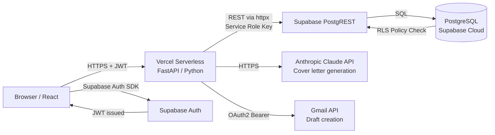
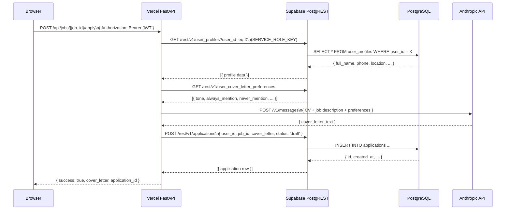

# System Architecture & Data Modeling
*Anti-Apathy Job Portal — Teknisk specifikation*
*Senast uppdaterad: 18 februari 2026*

> **Status:** Sektioner märkta med ⏳ väntar på schema introspection SQL-resultat för att fyllas i med faktiska värden.

---

## The High-Level View

This system utilizes a relational database model powered by **PostgreSQL (via Supabase)**. Business logic is split between a serverless Python backend on Vercel and direct PostgREST calls to Supabase.



---

## 1. Vilken databastyp och motor?

**Typ:** Relationell databas
**Motor:** PostgreSQL (hanterad av Supabase Cloud)
**Åtkomst:** Via Supabase's PostgREST-gränssnitt (auto-genererade REST-endpoints) och Supabase Storage

---

## 2. Centrala entiteter i schemat

⏳ *Fylls i från query #1 och #2 i schema introspection-resultaten.*

---

## 3. ER-diagram (Entity Relationships)

⏳ *Fylls i från query #3 (Foreign Keys) i schema introspection-resultaten.*

---

## 4. Primärnycklar

⏳ *Fylls i från query #2 (Primärnycklar) i schema introspection-resultaten.*

**Känt undantag från kod:** Tabellen `jobs` använder `TEXT` som primärnyckel:
```sql
id TEXT PRIMARY KEY  -- Platsbanken's egna jobb-ID
```
Anledning: Platsbanken's API returnerar egna IDn — att återanvända dem som PK undviker duplicat-jobb.

---

## 5. Foreign Keys och relationshantering

⏳ *Fylls i från query #3 (Foreign Keys) i schema introspection-resultaten, inkl. CASCADE-regler.*

---

## 6. Enumerated Types (Enums)

⏳ *Fylls i från query #9 (Check-constraints) i schema introspection-resultaten.*

---

## 7. Tidsstämplar

⏳ *Fylls i från query #1 (kolumntyper) — vilka tabeller har created_at / updated_at och av vilken typ.*

---

## 8. Index för läsprestanda

⏳ *Fylls i från query #4 (Index) i schema introspection-resultaten.*

---

## 9. Autentisering: Vercel → Supabase

Verifierat från `v2/api/index.py`:

```python
SUPABASE_URL = os.getenv("SUPABASE_URL")
SUPABASE_KEY = os.getenv("SUPABASE_SERVICE_ROLE_KEY") or os.getenv("SUPABASE_ANON_KEY")
SUPABASE_ANON_KEY = os.getenv("SUPABASE_ANON_KEY")
```

| Nyckel | Användning | Kringgår RLS? |
|--------|-----------|--------------|
| `SERVICE_ROLE_KEY` | Alla server-side operationer (scraping, CV-generering, Gmail-drafts) | **Ja** — fullständig access |
| `ANON_KEY` | Klientens auth-flöden (token-validering) | Nej — RLS gäller |

`SERVICE_ROLE_KEY` lagras aldrig i frontend-koden — den finns bara i Vercel's krypterade environment variable-store.

---

## 10. Supabase Client SDK vs direkt REST API

Backenden använder **inte** Supabase Python SDK. Istället görs direkta HTTP-anrop via `httpx` (async HTTP-klient) till Supabase's PostgREST-endpoint. Verifierat från `v2/api/index.py`:

```python
async def db_request(method: str, table: str, data: dict = None, params: dict = None):
    url = f"{SUPABASE_URL}/rest/v1/{table}"
    headers = {
        "apikey": SUPABASE_KEY,
        "Authorization": f"Bearer {SUPABASE_KEY}",
        "Content-Type": "application/json",
        "Prefer": "return=representation"
    }
    async with httpx.AsyncClient() as client:
        response = await client.request(method, url, headers=headers, ...)
```

**Varför direkt REST och inte SDK?**
- Supabase Python SDK är designad för synkrona operationer — FastAPI är async-native
- `httpx` ger fullständig kontroll över timeouts, retries och headers

**Frontend** (`v2/frontend.html`) använder **Supabase JavaScript SDK** för auth-flöden men kommunicerar med appens egna FastAPI-endpoints för all affärslogik.

---

## 11. Write-operation flöde

Exempel: Användaren klickar "Generera personligt brev" på ett jobb. Verifierat från `v2/api/index.py`.



---

## 12. Edge Functions vs Serverless Functions

Verifierat från `v2/vercel.json` och `v2/api/index.py`:

| Komponent | Plattform | Typ | Språk |
|-----------|-----------|-----|-------|
| API-backend | Vercel | **Serverless Functions** (Python) | FastAPI |
| Auth | Supabase | Supabase Auth (hanterad) | — |
| Frontend | Vercel | Static file serving | HTML/React/Tailwind |

**Supabase Edge Functions används inte.** All komplex logik (AI-anrop, Gmail-integration) körs i Vercel-backenden.

---

## 13. Database Connections & Connection Pooling

Varje anrop från backenden skapar en ny `httpx.AsyncClient()`-session (verifierat från kod). Sessionen stängs automatiskt efter anropet — ingen persistent databasanslutning.

```
Vercel Function (ephemeral)
    → httpx.AsyncClient (per-request, auto-closed)
        → Supabase PostgREST (HTTP)
            → PostgreSQL
```

Vercel Serverless Functions är stateless per design — ingen "connection leak"-risk.

---

## 14. Real-time prenumerationer

**Supabase Realtime används inte** — verifierat från kod (ingen WebSocket-prenumeration i `v2/frontend.html` eller `v2/api/index.py`).

Frontend uppdateras via klassisk request/response.

---

## 15. Stored Procedures & RPC

⏳ *Fylls i från query #7 (Funktioner) i schema introspection-resultaten.*

---

## 16. Database Triggers

⏳ *Fylls i från query #8 (Triggers) i schema introspection-resultaten.*

---

## 17. API-lagret — Arkitektur

Verifierat från `v2/api/index.py`. Systemet har två parallella API-lager:

### Supabase PostgREST (automatiskt)
Supabase genererar automatiskt RESTful endpoints för varje tabell — används av backenden via `db_request()`.

### FastAPI på Vercel (affärslogik)

```
POST   /api/scrape-jobs            → Scrapa Platsbanken + spara till Supabase
POST   /api/jobs/{id}/apply        → Hämta CV + anropa Claude + skapa Gmail-draft
GET    /api/gmail/status           → Kontrollera OAuth-status
GET    /api/gmail/auth             → Starta OAuth2-flöde (redirect till Google)
GET    /api/gmail/callback         → Hantera OAuth2 callback + spara tokens
POST   /api/master-cv/export       → Exportera Master CV
POST   /api/user/delete-data       → GDPR: radera all användardata
GET    /api/profile                → Hämta profil + erfarenheter + utbildning
```

---

## 18. Row Level Security (RLS)

⏳ *Fylls i från query #5 (RLS status) och query #6 (RLS policies) i schema introspection-resultaten.*

**Känt från kod:** Backenden använder `SERVICE_ROLE_KEY` som kringgår RLS för alla server-side operationer.

---

## 19. Databasmigrationer

| Aspekt | Nuläge |
|--------|--------|
| Verktyg | Manuell SQL i Supabase SQL Editor |
| Schema source of truth | `v2/supabase_schema.sql` i GitHub |
| Rollback | Manuellt |

---

## 20. Backup-strategi

⏳ *Kontrollera Supabase Dashboard → Database → Backups för faktisk backup-frekvens och retention på ditt specifika plan.*

**Känt:** Schema (`v2/supabase_schema.sql`) är versionshanterat i GitHub. Persondata exporteras inte till GitHub av GDPR-skäl.

---

## Sammanfattning — Arkitektoniska beslut

Verifierat från kod och konfigurationsfiler:

| Beslut | Val | Motivering |
|--------|-----|------------|
| Database | PostgreSQL via Supabase | Managed hosting, auth inbyggt, PostgREST |
| ORM | Ingen — direkt REST via httpx | FastAPI är async-native, SDK är synkron |
| Auth | Supabase Auth (JWT) | Google OAuth inbyggt |
| Backend | Vercel Serverless Python | Enkelt deploy, ingen server att underhålla |
| AI | Anthropic Claude API | Cover letter-generering på svenska |
| Email | Gmail API OAuth2 | Drafts i användarens egna Gmail |
| Frontend | Single-file React | Inga build-steg |

---

*⏳-sektioner fylls i när schema introspection SQL körts och resultaten klistrats in.*
