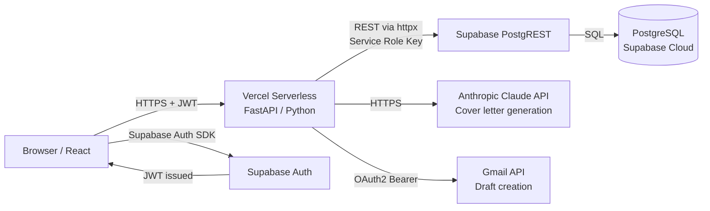
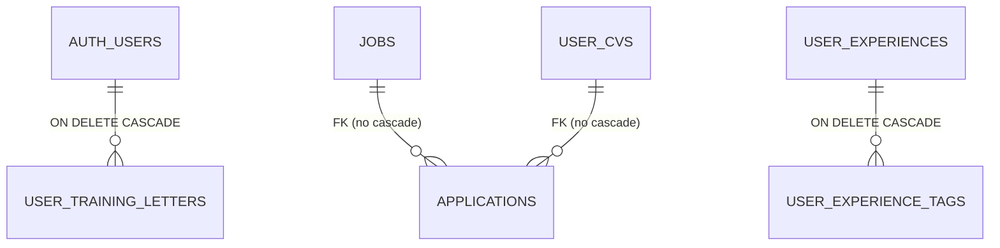
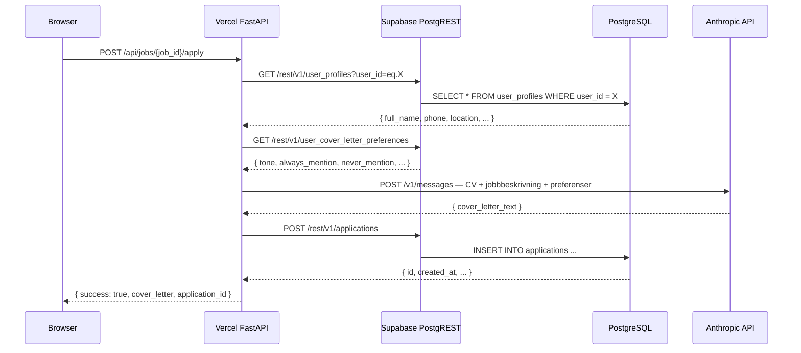

# System Architecture & Data Modeling
*Anti-Apathy Job Portal — Teknisk specifikation*
*Senast uppdaterad: 18 februari 2026*
*Källor: `v2/api/index.py`, `v2/vercel.json`, `v2/supabase_schema.sql`, `user_cover_letter_preferences` (live DB)*

---

## The High-Level View

This system utilizes a relational database model powered by **PostgreSQL (via Supabase)**. Business logic is split between a serverless Python backend on Vercel and direct PostgREST calls to Supabase.



---

## 1. Vilken databastyp och motor?

**Typ:** Relationell databas
**Motor:** PostgreSQL (hanterad av Supabase Cloud)
**Åtkomst:** Via Supabase's PostgREST-gränssnitt och Supabase Storage (3 buckets)

---

## 2. Centrala entiteter i schemat

**29 tabeller** grupperade i fem domäner. Radantal från live DB (2026-02-18):

| Domän | Tabell | Rader |
|-------|--------|-------|
| **Jobb** | `jobs` | 263 |
| **Användarprofil** | `user_skills` | 88 |
| | `user_experiences` | 27 |
| | `user_awards` | 18 |
| | `user_volunteer` | 12 |
| | `user_certifications` | 10 |
| | `user_education` | 4 |
| | `user_profiles` | 1 |
| | `user_cover_letter_preferences` | 1 |
| | `user_job_preferences` | 1 |
| **CV & Branscher** | `user_cv_branscher` | 8 |
| | `user_cvs` | 0 |
| | `bransch_cvs` | 0 |
| | `user_cv_uploads` | 0 |
| | `user_training_letters` | 0 |
| | `user_cv_versions` | 0 |
| | `user_cv_creation_conversations` | 0 |
| | `master_cv_exports` | 0 |
| **Jobbinteraktion** | `user_job_interactions` | 2 |
| | `applications` | 1 |
| **Gmail** | `user_google_credentials` | 1 |
| **Industri-specifikt** | `cv_industry_templates` | 4 |
| | `tech_certifications` | 14 |
| | `tech_projects` | 11 |
| | `artist_exhibitions` | 0 |
| | `artist_residencies` | 0 |
| | `artist_collections` | 0 |
| | `academic_publications` | 0 |
| | `user_experience_tags` | 0 |
| | `user_ai_feedback` | 0 |

---

## 3. ER-diagram (Entity Relationships)

Relationer verifierade från `v2/supabase_schema.sql`:



**Övriga tabeller** har `user_id TEXT` utan formell FK till `auth.users` — relationen enforças i applikationslagret.

---

## 4. Primärnycklar

| Tabell | PK-kolumn | Typ | Default |
|--------|-----------|-----|---------|
| Alla utom nedan | `id` | `UUID` | `gen_random_uuid()` |
| `jobs` | `id` | `TEXT` | Platsbanken's egna jobb-ID |
| `user_cover_letter_preferences` | `user_id` | `TEXT` | — (user_id är PK) |
| `user_job_preferences` | `user_id` | `TEXT` | — (user_id är PK) |
| `cv_industry_templates` | `id` | `TEXT` | `'traditional'`, `'artist'`, `'tech'`, `'academic'` |

**Varför `TEXT` för `jobs.id`?** Platsbanken's API returnerar egna IDn — att återanvända dem som PK undviker duplicat-jobb vid upprepad scraping.

---

## 5. Foreign Keys och relationshantering

Alla FK verifierade från `v2/supabase_schema.sql`:

| Från | Till | ON DELETE |
|------|------|-----------|
| `user_experience_tags.experience_id` | `user_experiences(id)` | `CASCADE` |
| `user_training_letters.user_id` | `auth.users(id)` | `CASCADE` |
| `applications.job_id` | `jobs(id)` | ingen |
| `applications.cv_id` | `user_cvs(id)` | ingen |

**Känd teknisk skuld — `user_id`-typinkonsistens:**

Beroende på när en tabell skapades är `user_id`-kolumnen antingen `UUID` eller `TEXT`. Dokumenterat i schemat:

```
UUID-typ:  user_cv_uploads, user_training_letters
TEXT-typ:  alla övriga tabeller (user_profiles, user_experiences,
           user_volunteer, user_awards, user_certifications,
           user_cv_branscher, user_experience_tags, bransch_cvs,
           master_cv_exports, artist_*, tech_*, academic_*,
           user_cv_creation_conversations, applications,
           user_cover_letter_preferences, user_job_preferences)
```

Workaround vid insert: `'da8ed517-...'::UUID` för UUID-tabeller, `'da8ed517-...'` för TEXT-tabeller.

---

## 6. Enumerated Types (Enums)

Systemet använder **inte** PostgreSQL `ENUM`-typen. Istället används `TEXT` med `CHECK`-constraint eller dokumenterade värden:

**`CHECK`-constraint (enforced i databasen):**
```sql
-- user_job_interactions
action TEXT NOT NULL CHECK (action IN ('viewed', 'skipped', 'applied', 'saved', 'rejected'))
```

**Dokumenterade värden (enforced i applikationslagret):**
```sql
-- applications.status
-- 'draft' | 'sent' | 'skipped' | 'saved' | 'interview' | 'rejected' | 'offer'
status TEXT DEFAULT 'draft'

-- user_ai_feedback.feedback_type
-- 'cover_letter' | 'new_bransch_request' | 'exclude_jobs' | 'general'
feedback_type TEXT DEFAULT 'cover_letter'

-- user_cover_letter_preferences.tone
-- 'professional_friendly' | 'formal' | 'casual' | 'warm'
tone TEXT DEFAULT 'professional_friendly'
```

---

## 7. Tidsstämplar

| Kolumnnamn | Tabeller | Typ |
|-----------|----------|-----|
| `created_at` | Nästan alla tabeller | `TIMESTAMPTZ DEFAULT NOW()` |
| `updated_at` | `user_profiles`, `user_cover_letter_preferences`, `user_job_preferences`, `user_cvs`, `bransch_cvs`, `user_google_credentials`, `applications` | `TIMESTAMPTZ DEFAULT NOW()` |
| `scraped_at` | `jobs` (istället för created_at) | `TIMESTAMPTZ DEFAULT NOW()` |
| `uploaded_at` | `user_training_letters` (istället för created_at) | `TIMESTAMPTZ DEFAULT NOW()` |
| `started_at` / `completed_at` | `user_cv_creation_conversations` | `TIMESTAMPTZ NOT NULL DEFAULT NOW()` / `TIMESTAMPTZ` |
| `last_updated` | `user_experiences` (extra kolumn) | `TIMESTAMPTZ` |

`updated_at` uppdateras manuellt av applikationslagret vid PATCH — ingen trigger hanterar det automatiskt.

---

## 8. Index för läsprestanda

Alla index är PostgreSQL-standard **B-tree**. Verifierat från `v2/supabase_schema.sql`:

| Index | Tabell | Kolumn(er) | Typ |
|-------|--------|-----------|-----|
| `idx_jobs_scraped_at` | `jobs` | `scraped_at DESC` | B-tree |
| `idx_jobs_contact_email` | `jobs` | `contact_email WHERE NOT NULL` | Partial B-tree |
| `idx_master_cv_exports_user` | `master_cv_exports` | `user_id` | B-tree |
| `idx_user_cvs_user` | `user_cvs` | `user_id` | B-tree |
| `idx_user_cvs_vibe` | `user_cvs` | `(user_id, vibe_id)` | B-tree |
| `idx_applications_user` | `applications` | `user_id` | B-tree |
| `idx_applications_status` | `applications` | `status` | B-tree |
| `idx_user_cv_branscher_user` | `user_cv_branscher` | `user_id` | B-tree |
| `idx_user_ai_feedback_user` | `user_ai_feedback` | `user_id` | B-tree |
| `idx_user_experience_tags_user` | `user_experience_tags` | `user_id` | B-tree |
| `idx_user_experience_tags_bransch` | `user_experience_tags` | `bransch_id` | B-tree |
| `idx_user_certifications_user` | `user_certifications` | `user_id` | B-tree |
| `idx_user_job_interactions_user` | `user_job_interactions` | `(user_id, created_at DESC)` | B-tree |
| `idx_user_job_interactions_job` | `user_job_interactions` | `job_id` | B-tree |
| `idx_user_job_interactions_unique` | `user_job_interactions` | `(user_id, job_id, action)` | **UNIQUE** |

---

## 9. Autentisering: Vercel → Supabase

Verifierat från `v2/api/index.py`:

```python
SUPABASE_URL = os.getenv("SUPABASE_URL")
SUPABASE_KEY = os.getenv("SUPABASE_SERVICE_ROLE_KEY") or os.getenv("SUPABASE_ANON_KEY")
SUPABASE_ANON_KEY = os.getenv("SUPABASE_ANON_KEY")
```

| Nyckel | Användning | Kringgår RLS? |
|--------|-----------|--------------|
| `SERVICE_ROLE_KEY` | Alla server-side operationer (scraping, CV-generering, Gmail-drafts) | **Ja** — fullständig access |
| `ANON_KEY` | Klientens auth-flöden (token-validering) | Nej — RLS gäller |

`SERVICE_ROLE_KEY` lagras aldrig i frontend-koden — den finns bara i Vercel's krypterade environment variable-store.

---

## 10. Supabase Client SDK vs direkt REST API

Backenden använder **inte** Supabase Python SDK. Istället görs direkta HTTP-anrop via `httpx` till Supabase's PostgREST. Verifierat från `v2/api/index.py`:

```python
async def db_request(method: str, table: str, data: dict = None, params: dict = None):
    url = f"{SUPABASE_URL}/rest/v1/{table}"
    headers = {
        "apikey": SUPABASE_KEY,
        "Authorization": f"Bearer {SUPABASE_KEY}",
        "Content-Type": "application/json",
        "Prefer": "return=representation"
    }
    async with httpx.AsyncClient() as client:
        response = await client.request(method, url, headers=headers, ...)
```

**Varför direkt REST?** Supabase Python SDK är synkron — FastAPI är async-native. `httpx` ger fullständig kontroll utan abstraktionslager.

**Frontend** (`v2/frontend.html`) använder **Supabase JavaScript SDK** enbart för auth (login, token refresh, session) — all affärslogik går via FastAPI-endpoints.

---

## 11. Write-operation flöde

Exempel: Användaren klickar "Generera personligt brev". Verifierat från `v2/api/index.py`:



---

## 12. Edge Functions vs Serverless Functions

Verifierat från `v2/vercel.json` och `v2/api/index.py`:

| Komponent | Plattform | Typ | Språk |
|-----------|-----------|-----|-------|
| API-backend | Vercel | Serverless Functions (Python) | FastAPI |
| Auth | Supabase | Supabase Auth (hanterad) | — |
| Databaslogik | PostgreSQL | 2 st PL/pgSQL-funktioner | SQL |
| Frontend | Vercel | Static file serving | HTML/React/Tailwind |

Supabase Edge Functions används inte.

---

## 13. Database Connections & Connection Pooling

Varje anrop skapar en ny `httpx.AsyncClient()` som stängs automatiskt (verifierat från kod). Ingen persistent databasanslutning — Vercel Serverless Functions är stateless per design.

```
Vercel Function (ephemeral)
    → httpx.AsyncClient (per-request, auto-closed)
        → Supabase PostgREST (HTTP)
            → PostgreSQL
```

---

## 14. Real-time prenumerationer

**Supabase Realtime används inte** — verifierat från kod. Ingen WebSocket-prenumeration finns i `v2/frontend.html` eller `v2/api/index.py`. Frontend uppdateras via klassisk request/response.

---

## 15. Stored Procedures & RPC

Verifierat från `v2/supabase_schema.sql` — 2 funktioner definierade:

```sql
-- Exporterar all CV-data som JSONB
-- Aggregerar: user_profiles, user_education, user_experiences,
-- user_volunteer, user_awards, user_skills, user_certifications,
-- tech_certifications, tech_projects
CREATE OR REPLACE FUNCTION export_master_cv(p_user_id TEXT)
RETURNS JSONB LANGUAGE plpgsql;

-- Anropar export_master_cv() och sparar snapshot i master_cv_exports
CREATE OR REPLACE FUNCTION save_master_cv_snapshot(p_user_id TEXT, p_notes TEXT DEFAULT NULL)
RETURNS UUID LANGUAGE plpgsql;
```

Anropas från backend via PostgREST RPC-endpoint: `POST /rest/v1/rpc/export_master_cv`.

---

## 16. Database Triggers

**Inga triggers är definierade** i `v2/supabase_schema.sql`.

Kommentarer i schemat anger "max 20 per user, enforced by trigger" för `user_training_letters` och `user_cv_uploads` — men triggern är inte skriven. Gränsen enforças inte i dagsläget.

---

## 17. API-lagret — Arkitektur

Verifierat från `v2/api/index.py`:

### Supabase PostgREST (automatiskt)
Auto-genererade CRUD-endpoints för varje tabell — används av backenden via `db_request()`.

### FastAPI på Vercel (affärslogik)

```
POST   /api/scrape-jobs              Scrapa Platsbanken + spara till Supabase
POST   /api/jobs/{id}/apply          Hämta CV + anropa Claude + skapa Gmail-draft
GET    /api/gmail/status             Kontrollera OAuth-status
GET    /api/gmail/auth               Starta OAuth2-flöde (redirect till Google)
GET    /api/gmail/callback           Hantera OAuth2 callback + spara tokens
POST   /api/master-cv/export         Anropa export_master_cv() RPC
POST   /api/user/delete-data         GDPR: radera all användardata
GET    /api/profile                  Hämta profil + erfarenheter + utbildning
```

---

## 18. Row Level Security (RLS)

**RLS är inte aktiverat** — verifierat från `v2/supabase_schema.sql` där alla RLS-kommandon är kommenterade:

```sql
-- Row Level Security (enable when you add auth)
-- ALTER TABLE user_profiles ENABLE ROW LEVEL SECURITY;
-- ALTER TABLE user_cvs ENABLE ROW LEVEL SECURITY;
-- ALTER TABLE applications ENABLE ROW LEVEL SECURITY;
```

Dataisolering sker idag via `SERVICE_ROLE_KEY` på serversidan — all databasaccess går genom Vercel-backenden, aldrig direkt från browsern med ett nyckel som har begränsad scope.

---

## 19. Databasmigrationer

| Aspekt | Nuläge |
|--------|--------|
| Verktyg | Manuell SQL i Supabase SQL Editor |
| Schema source of truth | `v2/supabase_schema.sql` i GitHub |
| Konvention | Datumkommentar vid varje ändring, t.ex. `-- Added 2026-02-17` |
| Rollback | Manuellt |

---

## 20. Backup-strategi

| Aspekt | Detaljer |
|--------|----------|
| Schema | `v2/supabase_schema.sql` versionshanterat i GitHub |
| Appdata | Supabase automatisk backup (frekvens/retention beror på plan — kolla Dashboard → Database → Backups) |
| Persondata | Exporteras inte till GitHub av GDPR-skäl |

---

## Supabase Storage Buckets

Verifierat från `v2/supabase_schema.sql` (bekräftad i dashboard 2026-02-18):

| Bucket | Visibility | Filtyper | Max storlek | Path-mönster |
|--------|-----------|----------|-------------|--------------|
| `profile-photos` | Public | jpeg, png, jpg, webp | 10 MB | `{user_id}/profile.{ext}` |
| `training-letters` | Public | pdf, docx, doc, txt | 50 MB | `{user_id}/letter_{timestamp}.{ext}` |
| `cv-files` | Public | pdf, docx, doc, txt, rtf, odt | 50 MB | `{user_id}/{vibe_id}_cv.{ext}` |

Alla 3 buckets har 4 RLS-policies: public read, authenticated upload, owner update, owner delete.

---

## Sammanfattning — Arkitektoniska beslut

Verifierat från kod och konfigurationsfiler:

| Beslut | Val | Motivering |
|--------|-----|------------|
| Database | PostgreSQL via Supabase | Managed hosting, auth inbyggt, PostgREST |
| ORM | Ingen — direkt REST via httpx | FastAPI är async-native, Supabase Python SDK är synkron |
| Auth | Supabase Auth (JWT) | Google OAuth inbyggt, ingen egen auth-kod |
| Backend | Vercel Serverless Python | Enkelt deploy, ingen server att underhålla |
| AI | Anthropic Claude API | Cover letter-generering på svenska |
| Email | Gmail API OAuth2 | Drafts i användarens egna Gmail |
| File storage | Supabase Storage | 3 publika buckets, integrerat med auth |
| Frontend | Single-file React | Inga build-steg, direkt redigerbar HTML |
