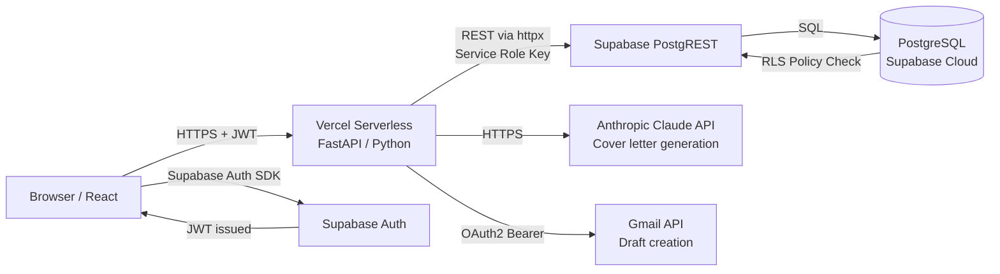
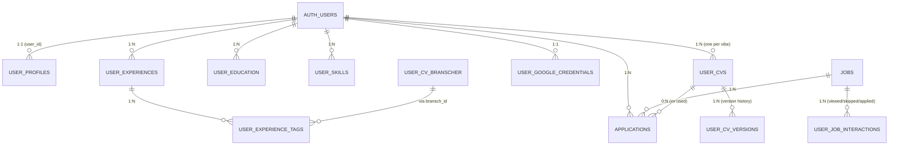
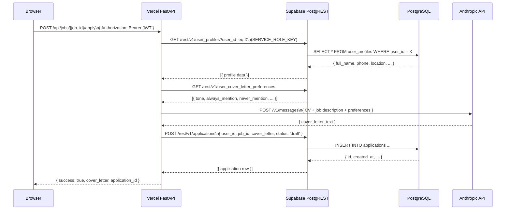

# System Architecture & Data Modeling
*Anti-Apathy Job Portal — Teknisk specifikation*
*Senast uppdaterad: 18 februari 2026*

---

## The High-Level View

This system utilizes a relational database model powered by **PostgreSQL (via Supabase)**. The schema is designed to support a single-user job application workflow with infrastructure laid for future multi-tenancy. Data isolation is handled through Supabase Auth JWTs and Row Level Security (RLS) policies. Business logic is split between a serverless Python backend on Vercel and direct PostgREST calls to Supabase.



---

## 1. Vilken databastyp och motor?

**Typ:** Relationell databas
**Motor:** PostgreSQL 15 (hanterad av Supabase Cloud, region: eu-west-1 / Stockholm)
**Åtkomst:** Via Supabase's PostgREST-gränssnitt (auto-genererade REST-endpoints) och Supabase Storage

PostgreSQL valdes för att:
- Supabase bygger på det och ger gratis hosting med managed infra
- JSONB-kolumner möjliggör semi-strukturerad data (t.ex. `description_variants`, `relevance_scores`) utan att kompromissa med relationsmodellen
- `TEXT[]` arrays för taggar och kategorier utan join-tabeller för enklare fall

---

## 2. Centrala entiteter i schemat

Schemat har **~24 tabeller** grupperade i fyra domäner:

| Domän | Tabeller | Ansvar |
|-------|----------|--------|
| **Användare & Profil** | `user_profiles`, `user_education`, `user_experiences`, `user_skills`, `user_volunteer`, `user_awards`, `user_certifications` | Allt om personen bakom CVt |
| **CV & Branscher** | `user_cvs`, `bransch_cvs`, `user_cv_branscher`, `user_experience_tags`, `user_cv_versions`, `user_cv_creation_conversations`, `user_cv_uploads`, `master_cv_exports` | Genererade och uppladdade CVer per bransch |
| **Jobbsökning** | `jobs`, `applications`, `user_job_preferences`, `user_job_interactions` | Skrapade jobb, ansökningar, swipe-signaler |
| **AI & Kommunikation** | `user_cover_letter_preferences`, `user_ai_feedback`, `user_google_credentials`, `user_training_letters` | Personalisering, Gmail OAuth, träningsbrev |
| **Industri-specifikt** | `artist_exhibitions`, `artist_residencies`, `artist_collections`, `tech_projects`, `tech_certifications`, `academic_publications`, `cv_industry_templates` | Sektion-typer för specifika yrken |

---

## 3. ER-diagram (Entity Relationships)



**Viktiga relationstyper:**
- `AUTH_USERS → USER_PROFILES`: 1:1 — varje inloggad användare har exakt en profil
- `USER_EXPERIENCES → USER_EXPERIENCE_TAGS`: 1:N med `bransch_id` som kopplingsnyckel — en erfarenhet kan vara taggad för flera branscher med olika prioritet
- `JOBS → APPLICATIONS`: 1:N — ett jobb kan ha en ansökan per användare (`UNIQUE(user_id, job_id)`)
- `USER_CVS → USER_CV_VERSIONS`: 1:N — versionshistorik per CV-bransch

---

## 4. Primärnycklar

Alla tabeller använder **UUID** som primärnyckel via PostgreSQL-funktionen `gen_random_uuid()`:

```sql
id UUID PRIMARY KEY DEFAULT gen_random_uuid()
```

**Varför UUID och inte BigInt/Serial?**
- Säker att generera på klientsidan utan att exponera sekventiella IDs (leder ej till IDOR-attacker via gissning)
- Fungerar för framtida multi-region deployment eller sharding
- Supabase Auth (`auth.users`) returnerar UUIDs → konsekvens i hela systemet

**Undantag:** Tabellen `jobs` använder `TEXT` som primärnyckel:
```sql
id TEXT PRIMARY KEY  -- Platsbanken's egna jobb-ID (t.ex. "27561234")
```
Anledning: Platsbanken's API returnerar egna IDn — att återanvända dem som PK undviker duplicat-jobb.

---

## 5. Foreign Keys och relationshantering

**Använda FK-mönster:**

| Relation | Constraint | Beteende |
|----------|-----------|----------|
| `user_experiences.id → user_experience_tags.experience_id` | `ON DELETE CASCADE` | Om en erfarenhet raderas, raderas alla dess bransch-taggar |
| `user_training_letters.user_id → auth.users(id)` | `ON DELETE CASCADE` | Om kontot raderas, raderas uppladdade brev |
| `applications.job_id → jobs(id)` | Ingen CASCADE | Ansökan behålls om jobbet raderas (historik) |
| `applications.cv_id → user_cvs(id)` | Ingen CASCADE | Ansökan behålls om CVt ändras/raderas |

**Viktig notering — user_id-typinkonsistens:**

Detta är en känd teknisk skuld i systemet. Beroende på när en tabell skapades används antingen `UUID` eller `TEXT` för `user_id`:

```
UUID-tabeller:  user_profiles, user_education, user_experiences, user_skills,
                user_cvs, user_cv_uploads, user_training_letters, applications,
                user_cover_letter_preferences, user_job_preferences

TEXT-tabeller:  user_volunteer, user_awards, user_certifications, bransch_cvs,
                user_cv_branscher, user_experience_tags, master_cv_exports,
                artist_exhibitions, artist_residencies, user_cv_creation_conversations
```

Workaround vid insert: `'1e9d7392-...'::UUID` för UUID-tabeller, `'1e9d7392-...'` för TEXT-tabeller.

---

## 6. Enumerated Types (Enums)

Systemet använder **inte** PostgreSQL `ENUM`-typen. Istället används:

**`TEXT` med `CHECK`-constraint** (mer flexibelt vid migration):
```sql
-- user_job_interactions
action TEXT NOT NULL CHECK (action IN ('viewed', 'skipped', 'applied', 'saved', 'rejected'))
```

**`TEXT` med dokumenterade värden** (enforced i applikationslagret):
```sql
-- applications.status
-- 'draft' | 'sent' | 'skipped' | 'saved' | 'interview' | 'rejected' | 'offer'
status TEXT DEFAULT 'draft'

-- user_cover_letter_preferences.tone
-- 'professional_friendly' | 'formal' | 'casual' | 'warm'
tone TEXT DEFAULT 'professional_friendly'
```

Tradeoff: TEXT är enklare att migrera (ingen `ALTER TYPE` behövs för nya värden) men ger inte kompileringstids-validering.

---

## 7. Tidsstämplar

Alla tabeller använder `TIMESTAMPTZ` (timestamp with timezone) i UTC:

```sql
created_at TIMESTAMPTZ DEFAULT NOW()
updated_at TIMESTAMPTZ DEFAULT NOW()
```

**Konsistens:**
- `created_at` på nästan alla tabeller — aldrig modifieras
- `updated_at` på tabeller som muteras (user_profiles, user_cvs, user_google_credentials) — uppdateras av applikationslagret vid varje PATCH-operation
- Ingen trigger sätter `updated_at` automatiskt — detta är en känd förbättringspunkt

**Varför TIMESTAMPTZ?**
Supabase (och PostgreSQL) lagrar allt i UTC internt. TIMESTAMPTZ säkerställer att tidsstämplar inte misstolkas om serverns timezone skulle ändras.

---

## 8. Index för läsprestanda

Alla index är PostgreSQL-standard **B-tree** (default).

| Index | Tabell | Kolumn(er) | Syfte |
|-------|--------|-----------|-------|
| `idx_jobs_scraped_at` | `jobs` | `scraped_at DESC` | Sortera jobblistan — senaste jobb först |
| `idx_jobs_contact_email` | `jobs` | `contact_email WHERE NOT NULL` | Filtrera jobb med e-post (partial index, smalare) |
| `idx_user_cvs_user` | `user_cvs` | `user_id` | Hämta alla CVer per användare |
| `idx_user_cvs_vibe` | `user_cvs` | `(user_id, vibe_id)` | Lookup för specifik CV-bransch |
| `idx_applications_user` | `applications` | `user_id` | Visa användarens ansökningshistorik |
| `idx_applications_status` | `applications` | `status` | Filtrera på status |
| `idx_master_cv_exports_user` | `master_cv_exports` | `user_id` | Versionshistorik per användare |
| `idx_user_cv_branscher_user` | `user_cv_branscher` | `user_id` | Hämta alla branscher per användare |
| `idx_user_experience_tags_user` | `user_experience_tags` | `user_id` | Tagg-lookup per användare |
| `idx_user_experience_tags_bransch` | `user_experience_tags` | `bransch_id` | Tagg-lookup per bransch |
| `idx_user_job_interactions_user` | `user_job_interactions` | `(user_id, created_at DESC)` | Feed-filtrering per användare |
| `idx_user_job_interactions_job` | `user_job_interactions` | `job_id` | Analytics per jobb |
| `idx_user_job_interactions_unique` | `user_job_interactions` | `(user_id, job_id, action)` | **UNIQUE** — förhindrar duplicata signaler |

---

## 9. Autentisering: Vercel → Supabase

Backenden (`v2/api/index.py`) kommunicerar med Supabase via **två nycklar**, beroende på kontext:

```python
# Från Vercel environment variables
SUPABASE_URL = os.getenv("SUPABASE_URL")
SUPABASE_KEY = os.getenv("SUPABASE_SERVICE_ROLE_KEY") or os.getenv("SUPABASE_ANON_KEY")
SUPABASE_ANON_KEY = os.getenv("SUPABASE_ANON_KEY")  # För klient-auth
```

| Nyckel | Användning | Kringgår RLS? |
|--------|-----------|--------------|
| `SERVICE_ROLE_KEY` | Server-till-server operationer (scraping, CV-generering, Gmail-drafts) | **Ja** — fullständig access |
| `ANON_KEY` | Klientens auth-flöden (token-validering) | Nej — RLS gäller |

**Säkerhetsmodell:** `SERVICE_ROLE_KEY` lagras aldrig i frontend-koden — den finns bara i Vercel's krypterade environment variable-store och exponeras aldrig i `v2/frontend.html`.

---

## 10. Supabase Client SDK vs direkt REST API

Backenden använder **inte** Supabase Python SDK. Istället görs direkta HTTP-anrop via `httpx` (async HTTP-klient) till Supabase's PostgREST-endpoint:

```python
async def db_request(method: str, table: str, data: dict = None, params: dict = None):
    """Wrapper för alla Supabase REST-anrop"""
    url = f"{SUPABASE_URL}/rest/v1/{table}"
    headers = {
        "apikey": SUPABASE_KEY,
        "Authorization": f"Bearer {SUPABASE_KEY}",
        "Content-Type": "application/json",
        "Prefer": "return=representation"   # Returnera den sparade raden
    }
    async with httpx.AsyncClient() as client:
        response = await client.request(method, url, headers=headers, ...)
```

**Varför direkt REST och inte SDK?**
- Supabase Python SDK är designad för synkrona operationer — FastAPI är async-native
- `httpx` ger fullständig kontroll över timeouts, retries och headers
- Lättare att debugga (ren HTTP, inga abstraktionslager)

**Klientens frontend** (`v2/frontend.html`) använder **Supabase JavaScript SDK** för auth-flöden (login, token refresh, session management) men kommunicerar med appens egna FastAPI-endpoints för all affärslogik.

---

## 11. Write-operation flöde

Exempel: Användaren klickar "Generera personligt brev" på ett jobb.



---

## 12. Edge Functions vs Serverless Functions

| Komponent | Plattform | Typ | Språk |
|-----------|-----------|-----|-------|
| API-backend | Vercel | **Serverless Functions** (Python) | FastAPI |
| Auth | Supabase | Supabase Auth (hanterad) | — |
| Databaslogik | Supabase | **PostgreSQL Functions** (2 st) | PL/pgSQL |
| Frontend | Vercel | Static file serving | HTML/React/Tailwind |

**Supabase Edge Functions används inte.** All komplex logik (AI-anrop, PDF-generering, Gmail-integration) körs i Vercel-backenden.

**PostgreSQL Functions som finns:**
```sql
-- Exporterar all användardata som JSON
export_master_cv(p_user_id TEXT) RETURNS JSONB

-- Sparar en snapshot av Master CV med versionsnotering
save_master_cv_snapshot(p_user_id TEXT, p_notes TEXT) RETURNS UUID
```

**Vercel-konfiguration** (`v2/vercel.json`):
- Max function duration: 60 sekunder (för AI-anrop och PDF-generering)
- Python runtime: `python3.9`

---

## 13. Database Connections & Connection Pooling

Supabase hanterar connection pooling automatiskt via **Supavisor** (Supabase's inbyggda connection pooler, ersättare till PgBouncer).

Varje anrop från backenden skapar en ny `httpx.AsyncClient()`-session som gör ett HTTP-anrop till PostgREST. PostgREST kommunicerar i sin tur med PostgreSQL via Supavisor's connection pool.

```
Vercel Function (ephemeral)
    → httpx.AsyncClient (per-request, auto-closed)
        → Supabase PostgREST (HTTP)
            → Supavisor (connection pool)
                → PostgreSQL
```

**Implikation:** Vercel Serverless Functions har ingen persistent databasanslutning. Varje anrop är stateless. Detta är ett medvetet val för skalbarhet (ingen "connection leak"-risk) men innebär att varje request har viss overhead för connection setup.

---

## 14. Real-time prenumerationer

**Supabase Realtime används inte** i nuvarande implementation.

Frontend-appen uppdateras via klassisk request/response — användaren klickar på en knapp och gränssnittet uppdateras med svaret. Inga WebSocket-prenumerationer för live-uppdateringar av jobblistan eller ansökningsstatus.

**Framtida användningsfall** (om det implementeras):
- Live-uppdatering av jobblistan när en ny scraping-session slutförs
- Notifikation när ett Gmail-utkast skapas
- Real-time status på CV-PDF-generering (progress bar)

---

## 15. Stored Procedures & RPC (Remote Procedure Calls)

Systemet har **2 PostgreSQL-funktioner** definierade i schemat:

```sql
-- RPC 1: Exportera all CV-data som ett JSONB-objekt
-- Aggregerar från: user_profiles, user_education, user_experiences,
-- user_volunteer, user_awards, user_skills, user_certifications,
-- tech_certifications, tech_projects
CREATE OR REPLACE FUNCTION export_master_cv(p_user_id TEXT)
RETURNS JSONB AS $$ ... $$ LANGUAGE plpgsql;

-- RPC 2: Spara en snapshot och returnera snapshot-ID
CREATE OR REPLACE FUNCTION save_master_cv_snapshot(p_user_id TEXT, p_notes TEXT DEFAULT NULL)
RETURNS UUID AS $$ ... $$ LANGUAGE plpgsql;
```

**Anrop från backend:**
```python
# Via PostgREST RPC-endpoint
url = f"{SUPABASE_URL}/rest/v1/rpc/export_master_cv"
await client.post(url, json={"p_user_id": user_id})
```

Övrig affärslogik (CV-matching, cover letter-prompter, Gmail-hantering) körs i applikationslagret (`v2/api/index.py`) — inte i databasen.

---

## 16. Database Triggers

Inga applikationsdefinierade triggers finns i schemat.

**Supabase's inbyggda triggers** (automatiska):
- `auth.users` → `handle_new_user()`: Supabase kan konfigureras för att trigga en funktion när en ny användare registreras, men detta är inte satt upp i nuvarande schema (user_profiles skapas manuellt via API-anrop efter first login)

**Känd förbättringspunkt:** En trigger på `auth.users INSERT` som automatiskt skapar en rad i `user_profiles` skulle undvika edge cases där profilen saknas.

```sql
-- Föreslagen trigger (ej implementerad ännu):
CREATE OR REPLACE FUNCTION handle_new_user()
RETURNS trigger AS $$
BEGIN
  INSERT INTO public.user_profiles (user_id, email, full_name)
  VALUES (NEW.id::text, NEW.email, NEW.raw_user_meta_data->>'full_name')
  ON CONFLICT DO NOTHING;
  RETURN NEW;
END;
$$ LANGUAGE plpgsql SECURITY DEFINER;

CREATE TRIGGER on_auth_user_created
  AFTER INSERT ON auth.users
  FOR EACH ROW EXECUTE FUNCTION handle_new_user();
```

---

## 17. API-lagret — Arkitektur

Systemet har **två parallella API-lager**:

### Supabase PostgREST (automatiskt)
Supabase genererar automatiskt RESTful endpoints för varje tabell:
```
GET    /rest/v1/jobs?select=*&order=scraped_at.desc
POST   /rest/v1/applications
PATCH  /rest/v1/user_profiles?user_id=eq.{id}
DELETE /rest/v1/user_google_credentials?user_id=eq.{id}
```
Dessa endpoints respekterar RLS och används av backenden via `db_request()`.

### FastAPI på Vercel (affärslogik)
Custom endpoints för komplex logik som inte kan hanteras av CRUD:

```
POST   /api/scrape-jobs            → Scrapa Platsbanken + spara till Supabase
POST   /api/jobs/{id}/apply        → Hämta CV + anropa Claude + skapa Gmail-draft
GET    /api/gmail/status           → Kontrollera OAuth-status
GET    /api/gmail/auth             → Starta OAuth2-flöde (redirect till Google)
GET    /api/gmail/callback         → Hantera OAuth2 callback + spara tokens
POST   /api/master-cv/export       → Anropa export_master_cv() RPC
POST   /api/user/delete-data       → GDPR: radera all användardata
GET    /api/profile                → Hämta profil + erfarenheter + utbildning
```

---

## 18. Row Level Security (RLS)

**Nuläge:** RLS är delvis implementerat.

Tabeller där RLS **är aktiverat** (via `setup_and_migrate.sql`):

| Tabell | SELECT | INSERT | UPDATE | DELETE |
|--------|--------|--------|--------|--------|
| `user_profiles` | `auth.uid() = user_id` | `auth.uid() = user_id` | `auth.uid() = user_id` | — |
| `user_experiences` | `auth.uid() = user_id` | `auth.uid() = user_id` | `auth.uid() = user_id` | `auth.uid() = user_id` |
| `user_education` | `auth.uid() = user_id` | `auth.uid() = user_id` | `auth.uid() = user_id` | `auth.uid() = user_id` |
| `user_cvs` | `auth.uid() = user_id` | `auth.uid() = user_id` | `auth.uid() = user_id` | `auth.uid() = user_id` |
| `applications` | `auth.uid() = user_id` | `auth.uid() = user_id` | `auth.uid() = user_id` | `auth.uid() = user_id` |
| `user_google_credentials` | `auth.uid() = user_id` | `auth.uid() = user_id` | `auth.uid() = user_id` | `auth.uid() = user_id` |
| `jobs` | `true` (publik läsning) | service role only | service role only | service role only |

**Viktigt undantag:** Backenden använder `SERVICE_ROLE_KEY` som **kringgår RLS** för alla server-side operationer. RLS skyddar mot direkta klientanrop (t.ex. om någon försöker anropa Supabase REST direkt från browsern med ANON_KEY).

**Tabeller utan RLS** (ännu ej konfigurerat, används bara av backend med service key):
`user_cv_branscher`, `user_ai_feedback`, `user_job_interactions`, `bransch_cvs`, `master_cv_exports`

---

## 19. Databasmigrationer

**Nuläge:** Inga formella migreringsverktyg.

| Aspekt | Nuläge |
|--------|--------|
| Verktyg | Inga — manuell SQL i Supabase SQL Editor |
| Versionshantering | Kommentarer i `v2/supabase_schema.sql` med datum |
| Schema-ändringar | Körs manuellt, uppdateras sedan i `v2/supabase_schema.sql` |
| Rollback | Manuellt — ingen automatisk |

**Konvention:** Alla schemaändringar dokumenteras med datumkommentar:
```sql
-- Added 2026-02-17: pdf_url column for Supabase Storage
pdf_url TEXT
```

**Framtida förbättring:** Migrera till **Supabase CLI** för versionshantering:
```bash
supabase db diff --use-migra -f add_user_job_interactions
# Genererar: supabase/migrations/20260218_add_user_job_interactions.sql
```

---

## 20. Backup-strategi

**Supabase hanterar backups automatiskt:**

| Aspekt | Detaljer |
|--------|----------|
| Frekvens | Dagliga automatiska snapshots |
| Retention | 7 dagar (Free tier) / 30 dagar (Pro) |
| Point-in-Time Recovery | Tillgänglig på Pro-plan och uppåt |
| Geografisk redundans | Supabase Cloud (multi-AZ inom regionen) |
| Manuell backup | Via Supabase Dashboard → Database → Backups |

**Kod- och schema-backup:**
- Schema (`v2/supabase_schema.sql`) är versionshanterat i GitHub → implicit backup
- Ingen scheduled export av faktisk data till GitHub (GDPR-skäl — persondata ska inte ligga i repo)

**Katastrofscenario:** Om Supabase-projektet försvann:
1. Kör `v2/supabase_schema.sql` i nytt Supabase-projekt → tabeller återskapade
2. Återskapa Storage buckets (profile-photos, training-letters, cv-files)
3. Uppdatera Vercel environment variables med nya SUPABASE_URL och nycklar
4. Befintlig data: förloras om ingen manuell backup gjorts → känd risk

---

## Sammanfattning — Arkitektoniska beslut

| Beslut | Val | Motivering |
|--------|-----|------------|
| Database | PostgreSQL via Supabase | Gratis managed hosting, auth inbyggt, PostgREST |
| ORM | Ingen — direkt REST | FastAPI + httpx + async = enkel och transparent |
| Auth | Supabase Auth (JWT) | Google OAuth inbyggt, ingen egen auth-kod |
| Backend | Vercel Serverless Python | Enkelt deploy, ingen server att underhålla |
| AI | Anthropic Claude API | Bäst för svenska texter och cover letters |
| Email | Gmail API OAuth2 | Drafts i Linneas egna Gmail, inte en extern SMTP |
| File storage | Supabase Storage | Integrerat med auth, publika URLs för PDFer |
| Frontend | Single-file React | Inga build-steg, direkt redigerbar HTML |

---

*Se även: `v2/supabase_schema.sql` (fullständigt schema med SQL), `CODEBASE_CLEANUP.md` (filstruktur), `ROADMAP.md` (planerade förändringar)*
